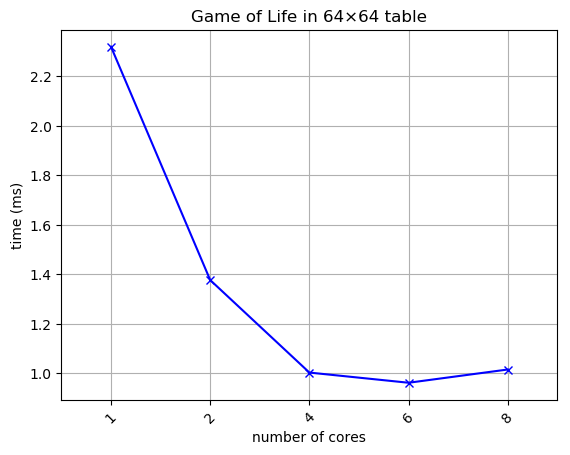
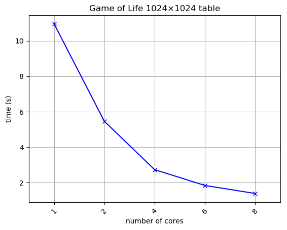
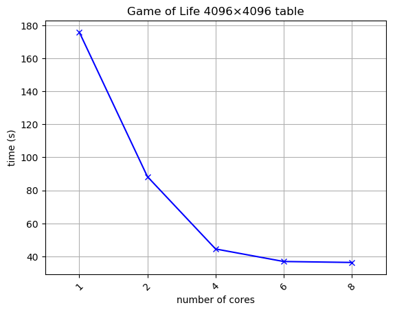
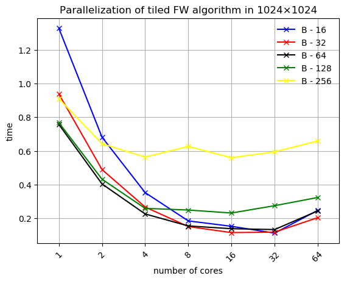
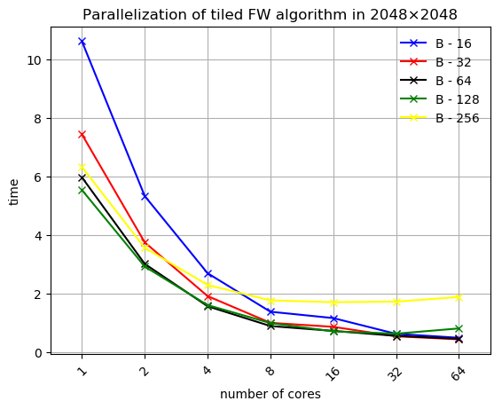
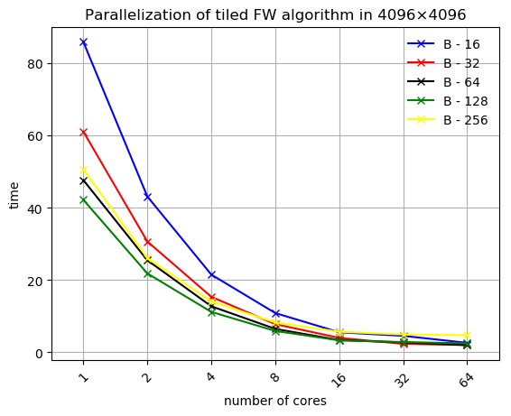

##  Parallelization of Conway's Game of Life using OpenMP

- Serial implementation in [ex1/serial](./ex1/serial).
- OpenMP parallel implementation in [ex1/parallel](./ex1/parallel)

- Figures of parallel implementation

  
   
  

##  Parallelization of Floyd-Warshall algorithm using OpenMP and TBB

- Serial implementation in [ex2/serial](./ex2/serial).
- OpenMP parallel implementations in [ex2/parallel/OpenMP](./ex2/parallel/OpenMP)
- TBB parallel implementations in [ex2/parallel/tbb](./ex2/parallel/tbb)

- Statistics of fastest implementation: 
  
  | Nodes | Algorithm | Programming Tool |   Technique  | Cores | Block size  | Time (s)  | Speedup  |
  | ---------| --------- | ---------------- | -------------| ----- |-------------| ----------| ---------|
  |    1024  |   Tiled   |      OpenMP      | Parallel For |  32   |      16     | __0.1119__|   __9.31__   |
  |    2048   |   Tiled   |      OpenMP      | Parallel For |  64   |      32     | __0.4380__|  __17.8__  |
  |     4096   |   Tiled   |      OpenMP      | Parallel For |  64   |      64     | __1.9922__|   __31.4__   |

- Figures of fastest implementation:

  
  
  

    
    
