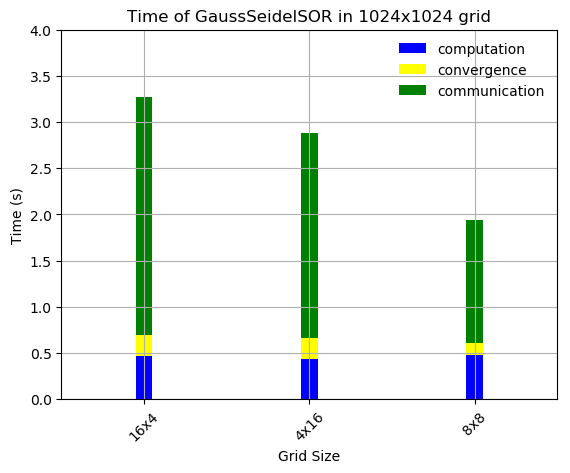

## Parallelization of the Heat Equation using MPI

### Algorithms
 - Jacobi
 - Gauss-Seidel SOR
 - Red-Black SOR

### Brief results

- Scalability test

 

  
   
  

- Speed test

 

  
   
  

- Analytic results in 1024x1024

  |      Algorithm   | Grid | Iterations | Compute | Converge | Communicate  | Parallel Time (s) |
  | -----------------| ---- | ---------- | --------| -------- |--------------| ---------------| 
  |        Jacobi    |  8x8 |   798201   | 40.28   |  9.49    | 217.01       |   266.78       |
  | Gauss-Seidel SOR |  8x8 |   3021     | 0.48    |  0.13    |  1.33        |   1.94         |
  |   Red-Black SOR  |  8x8 |   2501     | 0.31    |  0.08    |  1.38        |  1.97          |

### Project Structure

- Project description in Greek [here](pps-exercise2-2019-20.pdf).
- Serial implementations in [serial](serial).
- Parallel MPI implementations in [parallel](parallel).
- Final report in Greek in [report](report).
- Plots and scripts in [plots](plots).

