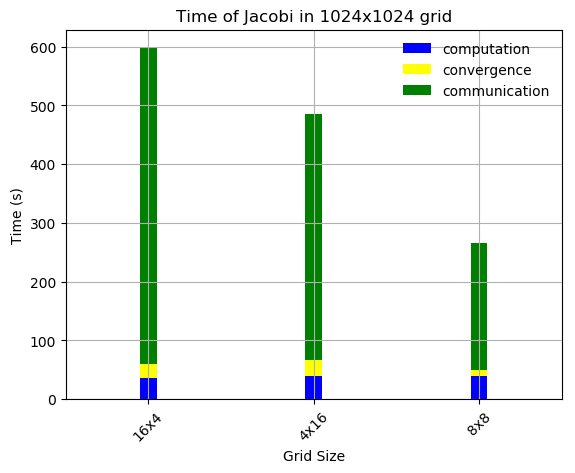
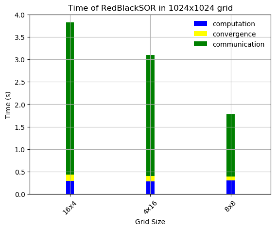

## Parallelization of the Heat Equation using MPI

### Algorithms
 - Jacobi
 - Gauss-Seidel SOR
 - Red-Black SOR

### Brief results

- Scalability test

 

  
   
  

- Speed test

 

  
   
  

### Project Structure

- Project description in Greek [here](pps-exercise2-2019-20.pdf).
- Serial implementations in [serial](serial).
- Parallel MPI implementations in [parallel](parallel).
- Final report in Greek in [report](report).
- Plots and scripts in [plots](plots).

