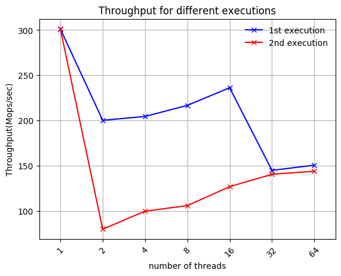
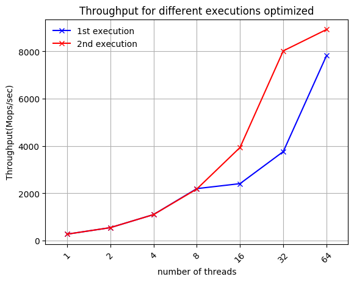
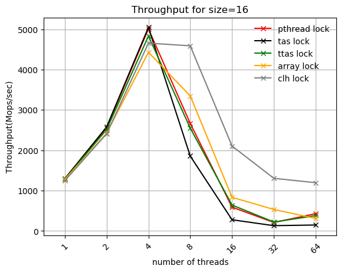
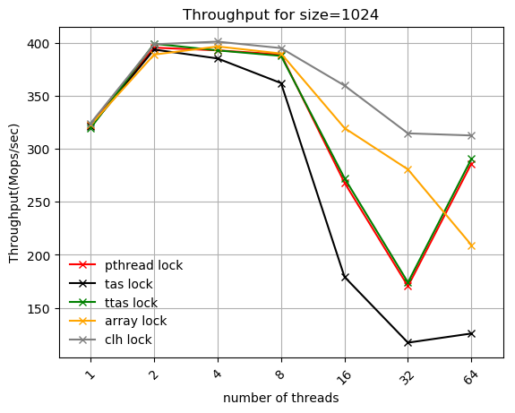
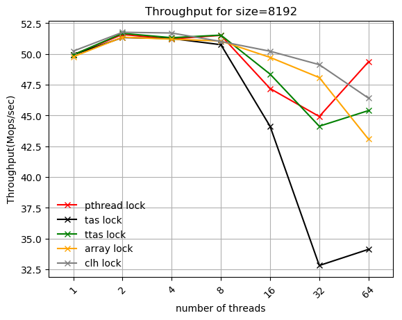
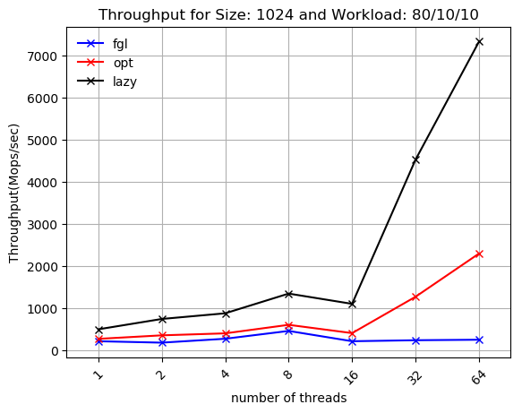
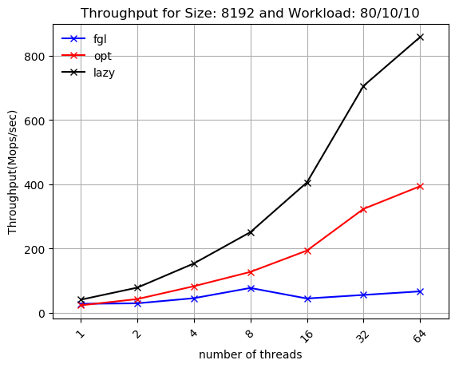
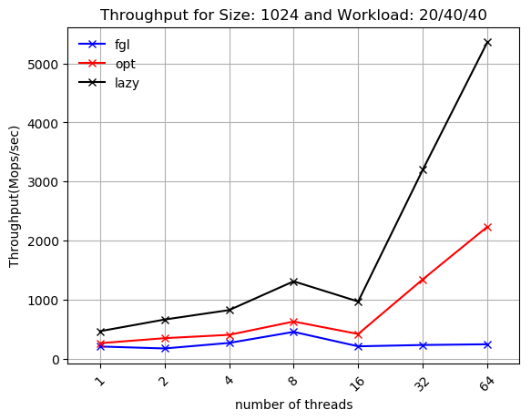
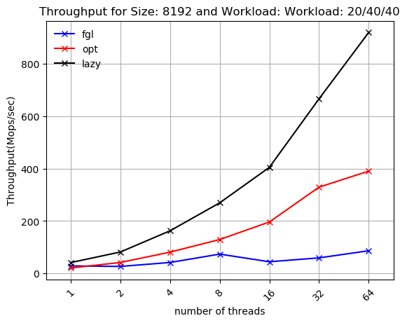

## Cache hierarchy and Scalability

Simple transaction system where scalability fails due to incorrect handling of cache hierarchy.

  
  

## Mutual Exclusion - Locks

### Type of locks
 - pthread_lock
 - tas_lock
 - ttas_lock
 - array_lock
 - clh_lock
 
 ### Results
 
 

  
  
  

## Synchronization techniques in Data Structures

### Types of synchronization
  - Fine-grain locking
  - Optimistic synchronization
  - Lazy synchronization

 ### Results
 
 - When searches > insertions-deletions
 
 
 

  
  

 - When searches < insertions-deletions
 
 

  
  

## Project Structure
- Project description in Greek [here](pps-exercise3-2019-20.pdf).
- Cache hierarchy and Scalability in [ex1-cache](ex1-cache).
- Mutual Exclusion - Locks in [ex2-lock](ex2-lock).
- Synchronization techniques in Data Structures in [ex3-ds](ex3-ds).
- Final report in Greek in [report](report).

